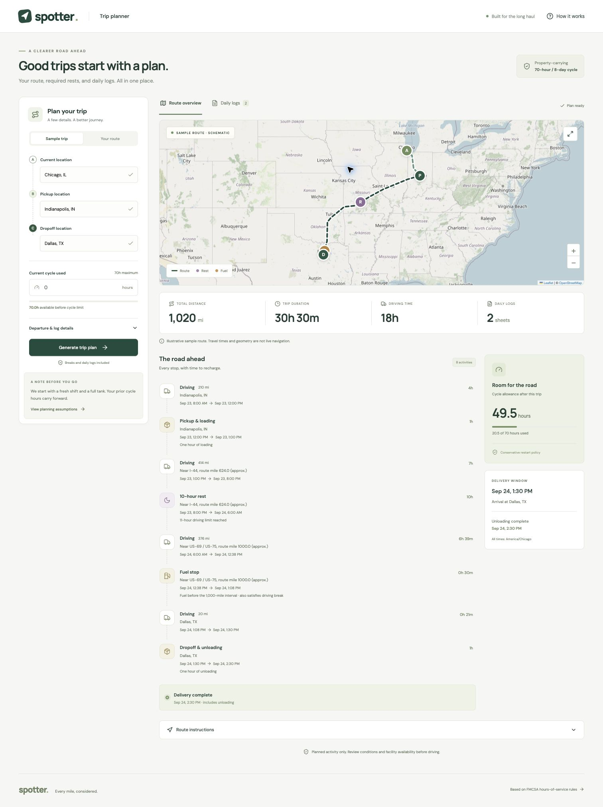
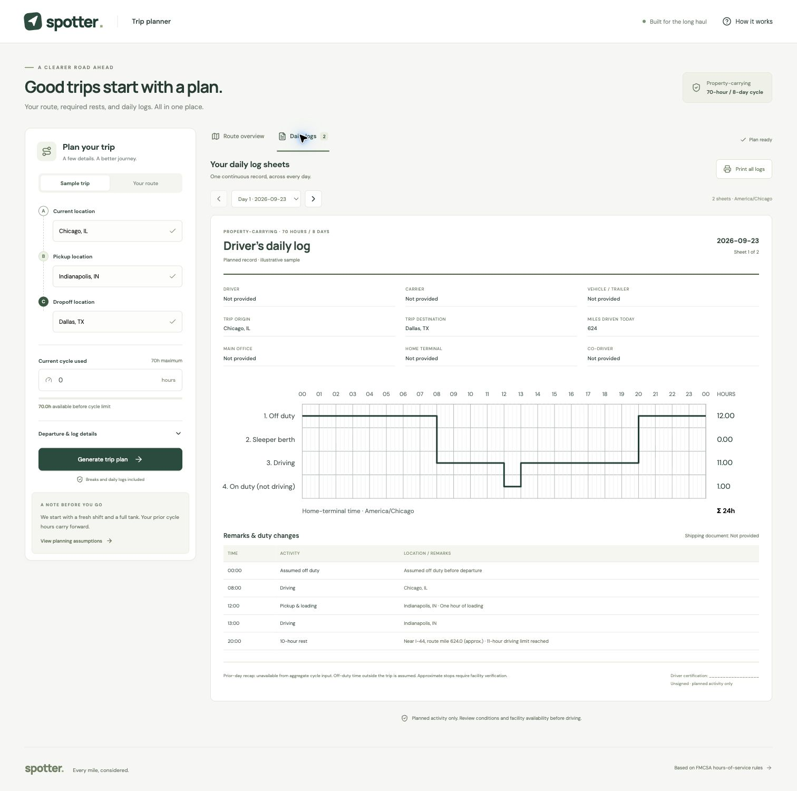

# Spotter

## Plan the trip. See the road ahead.

Spotter is an HOS-aware trip-planning workspace for property-carrying truck trips. Give it a current location, pickup, dropoff, departure details, and current cycle usage. It turns those inputs into a route plan, a reasoned activity timeline, and printable driver daily logs.



_The sample trip shows the route map, required stops, trip totals, cycle allowance, and the activity timeline in one view._

## Why Spotter

- **Plan the whole trip:** origin, pickup, dropoff, loading, unloading, driving, rest, and fuel are shown together.
- **Make HOS decisions visible:** the scheduler explains why a stop was inserted instead of hiding the rule inside a total.
- **Generate usable logs:** each terminal-time-zone day becomes a printable SVG driver log sheet.
- **Start safely with a sample:** the full product flow works without an external routing key.
- **Use live routing when ready:** OpenRouteService geocoding and `driving-hgv` directions stay behind the Django API.
- **Keep one source of truth:** the map, summary cards, itinerary, and daily logs all render from the same planned event timeline.

## How a trip moves through the product

1. **Enter the trip** — choose the sample or live route, set current cycle hours, and optionally add departure, terminal, driver, carrier, and shipment details.
2. **Resolve the route** — live mode geocodes the three locations and requests a heavy-goods vehicle route. Sample mode uses an explicitly labeled illustrative route.
3. **Build the schedule** — the backend advances through road steps and work activities, inserting legal rest, break, fuel, and cycle-restart events where needed.
4. **Project the result** — the same event list powers the map markers, route summary, expandable itinerary, delivery window, and daily log sheets.
5. **Review and print** — inspect the assumptions, move between log days, and use **Print all logs** to export the sheets through the browser.

## Product views

### Route overview

The route view makes the plan easy to scan: map markers identify pickup, rest, fuel, and delivery; summary cards show distance and time; and the itinerary explains each activity and its reason.

### Driver daily logs



_Each day is projected in the selected home-terminal time zone, with duty-status graphs, remarks, mileage, and certification fields ready for review._

## Run it locally

Requirements: Python 3.11+ and Node.js 22+.

```sh
python3 -m venv .venv
.venv/bin/pip install -r backend/requirements.txt
npm --prefix frontend ci
cp .env.example .env
./dev.sh
```

Open [http://127.0.0.1:5173](http://127.0.0.1:5173). Choose **Generate trip plan** to run the sample immediately. No database or migrations are required.

### Enable live routing locally

Add your own key to the root `.env` file:

```dotenv
ORS_API_KEY=your-openrouteservice-key
```

Restart `./dev.sh`, select **Your route**, search for three locations, select the results, and generate the plan. The key is read by the backend and is never needed in frontend code. Keep `.env` private; it is ignored by Git.

## HOS planning scope

Spotter currently models the normal property-carrying 70-hour / 8-day workflow:

- 11 hours of driving inside a 14-hour window.
- A 30-minute non-driving break after 8 accumulated driving hours.
- A 10-hour off-duty rest to reset daily driving and window limits.
- A 60/70-hour cycle, based on the selected current cycle usage.
- A 34-hour restart when the conservative cycle policy blocks further driving.
- One hour for pickup and one hour for dropoff; both count as on-duty time.
- Fuel stops planned around the 1,000-mile interval; a fuel stop can also satisfy the driving break.
- Daily mileage split using road-step timing, including trips that cross midnight or daylight-saving changes.

The output is a planned activity record, not a certified ELD or a record of actual driving. It does not model split-sleeper, adverse-condition, personal-conveyance, short-haul, or team-driver exceptions. Fuel and rest locations are approximate and must be verified before use. The sample route is schematic and is not live navigation.

## API surface

| Endpoint | Purpose |
| --- | --- |
| `GET /api/health` | Process health check |
| `GET /api/config` | Routing availability, sample locations, and CSRF setup |
| `GET /api/locations?q=...` | Location search for live routing |
| `POST /api/trips/plan` | Creates a route plan, timeline, summary, and daily logs |

The browser obtains the CSRF token from `/api/config` and sends it with planning requests.

## Deployment

The Docker image builds the React frontend and serves it with Django, WhiteNoise, and Gunicorn as one service:

```sh
docker build --platform linux/amd64 -t spotter-planner:latest .
docker run --rm -p 8000:8000 --env-file .env.production spotter-planner:latest
```

Configure secrets and deployment-specific values through the hosting platform—not in the image or repository:

```dotenv
DEBUG=0
SECRET_KEY=a-long-random-value
ALLOWED_HOSTS=your-hostname
CSRF_TRUSTED_ORIGINS=https://your-hostname
ORS_API_KEY=your-openrouteservice-key
```

For a container service, expose HTTP port `8000` and use `/api/health` as the public health-check path. When deploying a new version, push the rebuilt image and then create a new deployment using that image while preserving the environment variables and health-check settings.

## Project shape

```text
backend/planner/scheduler.py   HOS event loop and route-position interpolation
backend/planner/logs.py        Daily projection, mileage, and DST handling
backend/planner/routing.py     OpenRouteService adapter and sample route
backend/planner/views.py       Validation and CSRF-protected JSON API
frontend/src/App.tsx           Planner form and result views
frontend/src/components/       Location search, map, itinerary, and log sheets
Dockerfile                     Production image for the combined service
dev.sh                          Local frontend + backend development server
```

## Verify changes

```sh
.venv/bin/python backend/manage.py test planner
npm --prefix frontend run build
```

The repository is intentionally small: no accounts, trip persistence, background workers, or database are needed for the planning workflow.
